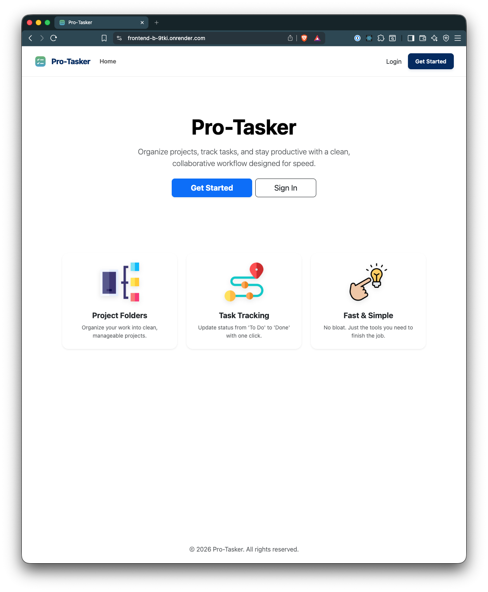

# ✅ Pro-Tasker Frontend – MERN Full-Stack Capstone

A modern, responsive project management interface for **Pro-Tasker**, a collaborative MERN stack application built for individuals and small teams to manage projects and tasks efficiently.

The frontend communicates with a secure backend API and delivers authentication, project workflows, and task management through a dynamic React + TypeScript application.

---

## 🌐 Live Application

**Live Demo:**

> **Live Demo:** _[Click Here for Live Demo](https://frontend-b-9tki.onrender.com/)_

**Demo Video Walkthrough:**

> **Demo Video Walkthrough:** _[Click Here for Walkthrough](https://youtu.be/j7-10ilHeCw)_

---

## ⚠️ Render Hosting Notice

This application is hosted using **Render's free tier**.

The backend service may enter **hibernation after periods of inactivity**.
When accessing the live demo for the first time:

- Initial requests may take **10–30 seconds** to respond
- This delay occurs while the backend service wakes up
- After activation, the application performs normally

This behavior is expected for free-tier deployments.

---

## 🖼️ Screenshots



Suggested screenshots:

- Authentication (Login/Register)
- Projects Dashboard
- Project Details + Tasks
- Dark Mode Interface
- Responsive Mobile Layout

---

## 🎓 Capstone Overview

**Pro-Tasker** was developed as a full-stack MERN portfolio project demonstrating:

- Secure authentication & authorization
- RESTful API integration
- Frontend state management
- Responsive UI design
- Production deployment workflows
- Real-world full-stack architecture

The project reflects practical development patterns used in modern SaaS-style applications.

---

## 🎯 Application Capabilities

### 🔐 Authentication

- Secure user registration and login
- JWT-based authentication
- Global Auth Context state management
- Protected and public route handling
- Persistent login sessions

### 📁 Project Management

- Project creation with titles and descriptions
- Dashboard overview of user-owned projects
- Editing and deletion restricted to project owners
- Dedicated project detail views

### ✅ Task Management

- Task creation within projects
- Status updates and content modification
- Task deletion controls
- Structured and reusable component system

### 🎨 User Experience

- Responsive Bootstrap layout
- Persistent Light/Dark theme support
- API loading states and error handling
- Clean component separation and scalable structure

---

## 🧱 Architecture Overview

### Frontend Responsibilities

- React-based UI rendering
- Global authentication state via Context API
- Axios-based API communication layer
- Route protection and navigation control
- Local Storage token persistence

### Backend Responsibilities

- JWT authentication and validation
- MongoDB data storage
- RESTful API routing
- Authorization enforcement
- Secure resource ownership rules

---

## 🔗 Backend API

Local Development Endpoint:

```
http://localhost:3001
```

Production Endpoint:

```
https://backend-b-0xau.onrender.com
```

API configuration is handled within:

```
frontend/src/utils/api/axiosInstance.ts
frontend/.env
```


---

## 💻 Running Locally

### Prerequisites

* Node.js **18+** (Node 20 LTS recommended)
* npm **9+**
* Pro-Tasker Backend API running locally or deployed

The frontend requires a live backend connection for authentication and data loading.

---

### Environment Configuration

Create a `.env` file inside the `frontend/` directory:

```bash
VITE_API_URL=http://localhost:3001
```

**Environment Notes**

* Use the **backend base URL only** (do not include `/api`)
* API routes are automatically appended by the frontend
* Production example:

```bash
VITE_API_URL=https://your-backend.onrender.com
```

---

### Install Dependencies

Inside the `frontend/` directory:

```bash
npm install
```

---

### Start Development Server

```bash
npm run dev
```

Application runs at:

```
http://localhost:5173
```

---

### Backend Requirement

Ensure the backend server is running and accessible before launching the frontend.

Expected local backend URL:

```
http://localhost:3001
```

---

## 🔗 Backend Repository

The Pro-Tasker frontend connects to a separate MERN backend responsible for authentication, API routing, and data management.

👉 **Backend Source Code:**
[https://github.com/structbase/Pro-Tasker-Backend](https://github.com/structbase/Pro-Tasker-Backend)]

The backend provides:

* JWT authentication and authorization
* RESTful API endpoints
* MongoDB data persistence
* Project and task management logic
* Secure user data handling


---

## 🚀 Deployment

Frontend Build Output:

```
dist
```

Compatible Hosting Platforms:

- Vercel
- Netlify
- Cloudflare Pages
- Render Static Hosting
- GitHub Pages (SPA routing supported)

---

## 🛠️ Built With

- React + TypeScript
- React Router
- Axios
- Bootstrap
- Context API
- Vite

---

## 📂 Project Structure

```
frontend/
├── public/
├── src/
│   ├── components/
│   ├── context/
│   ├── pages/
│   ├── utils/
│   └── App.tsx
├── index.html
├── vite.config.ts
└── package.json
```

### Architectural Concepts

- Component-driven development
- Route-based page organization
- Separation of concerns
- API abstraction layer
- Context-driven authentication state

---

## 🔐 Authentication Details

Local Storage Keys:

- `pro_tasker_token`
- `pro_tasker_user`

Security Features:

- Route protection for authenticated pages
- Persistent login state restoration
- Automatic logout on token failure

---

## 📊 Portfolio Highlights

This project demonstrates:

- Full MERN stack integration
- JWT authentication workflows
- React Context API state management
- REST API consumption
- Secure frontend architecture
- Production-style deployment practices
- Real-world project structure and scalability

---

## ✍️ Author

Developed by **Abenezer**

---

### 🧠 Technical Challenges Solved

- Persistent auth state across reloads
- Route-level access control
- Scalable component architecture
- Frontend/backend environment separation
- SPA routing with protected navigation
